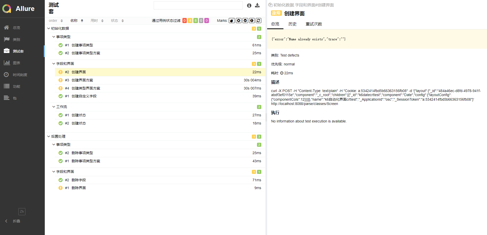
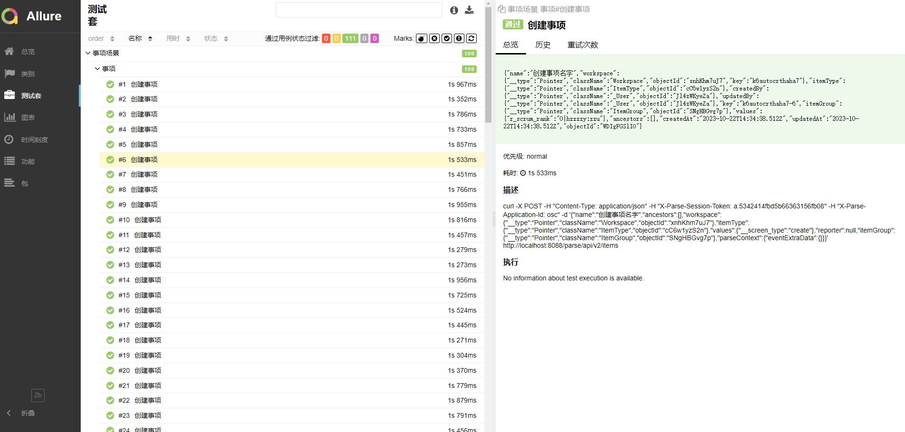
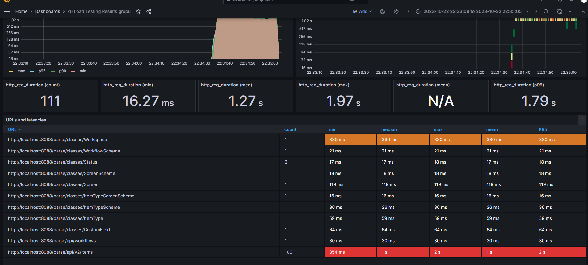

# k6auto-基于k6的全新自动化框架
- 接口自动化
- 接口性能自动化
- 前端性能自动化


## k6 api自动化
#### 编写底层api
暂未补充
#### 根据编写的的api来书写用例，组装场景
暂未补充
#### 生成allure报告
```
//执行测试，先删除旧的report.log
.\k6.exe run --console-output 'report.log' .\main.js
//生成日志，这一步未来会替换为扩展就可以不需要执行了
node ./logger/logger.js
//查看报告，先删除原来整个2023-10-21文件夹
allure serve .\2023-10-21\  
```




## k6 api性能自动化自动化
```
//前面做api自动化已经编号用例了，直接拿来用就可以了
//只需要编写需要测试的性能场景，即可完成对应用例的性能场景测试
scenarios: {
    //这个场景是5个VU每个20迭代，也就是5并发，每个并发下执行20次function中的行为
    contacts: {
        executor: 'per-vu-iterations',
        vus: 5,
        iterations: 20,
        maxDuration: '5m',
        exec: 'scenarios_item',
        tags: { my_custom_tag: '事项相关场景' },
        env: { MYVAR: 'contacts' },
      }
  },
//重定向到influxdb，并接入grafana
 .\k6.exe run --console-output 'report.log' --out influxdb=http://localhost:8086/mydb .\performance.js
```





## TUDO
- [ ] k6 丰富实战项目的api自动化测试，api性能自动化
- [ ] k6 browser 实战
- [ ] go zap扩展
- [ ] k6 redis demo
- [ ] k6 pgql demo
- [ ] k6 websocket demo
- [ ] k6 kafka demo
- [ ] k6 k8s demo
- [ ] k6 grpc demo

